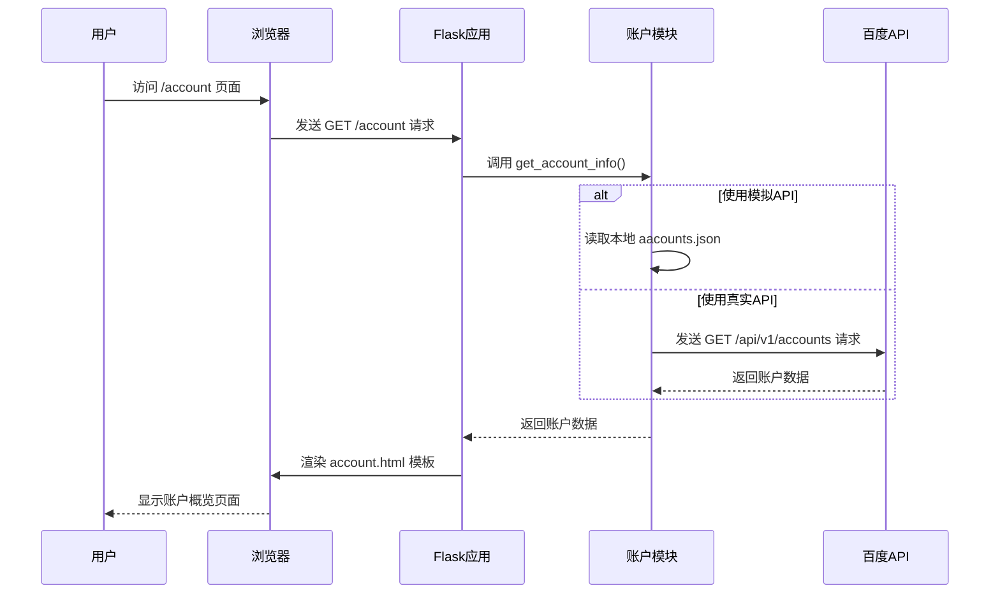
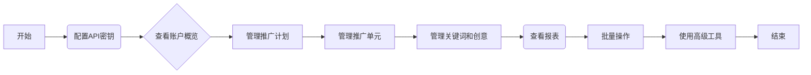

# 百度搜索广告投放管理系统

这是一个功能全面的百度搜索广告投放管理系统，基于Python Flask框架开发。本项目旨在提供一个高效、便捷的平台，帮助用户管理和优化其百度搜索广告活动。

## 主要功能

- **分层级的物料管理**: 支持从账户、推广计划、推广单元到关键词和创意的全层级物料管理。
- **配置灵活**: 提供API密钥的加密存储和灵活的配置选项，包括在模拟数据和真实API之间切换。
- **数据可视化**: 通过图表和摘要报告，直观展示关键的广告性能指标。
- **批量操作**: 支持通过CSV文件进行批量导入和导出，大大提高操作效率。
- **高级工具**: 内置关键词推荐和拓展工具，助力广告策略优化。

## 项目架构

```mermaid
graph TD
    A[用户] --> B{浏览器}
    B --> C[Flask Web应用 (app.py)]
    C --> D{业务逻辑层 (src/)}
    D --> E_API[百度推广API]
    D --> E_Local[本地JSON文件 (模拟数据)]
```

## 模块详解

### `src/` 目录

| 文件 | 描述 |
|---|---|
| `config.py` | 管理应用的配置，包括API密钥的加载、保存和加解密。 |
| `account.py` | 负责获取和显示账户基本信息。 |
| `campaign.py` | 管理推广计划，包括加载、保存、搜索、筛选和批量更新。 |
| `adgroup.py` | 管理推广单元，与推广计划关联。 |
| `keyword.py` | 管理关键词，与推广单元关联。 |
| `creative.py` | 管理创意，与推广单元关联。 |
| `analysis.py` | 提供数据分析功能，如生成摘要报告和CSV报告。 |
| `batch.py` | 实现批量操作，如从CSV导入和导出。 |
| `keyword_tool.py` | 提供关键词推荐和拓展等高级工具。 |
| `audience.py` | 管理人群包。 |
| `ocpc.py` | 管理oCPC投放包。 |
| `store.py` | 管理门店信息。 |

## 函数调用关系 (以账户模块为例)



## 用户使用流程



## 部署与运行

### 1. 环境准备

- Python 3.8+
- `pip` 和 `venv`

### 2. 部署步骤

1.  **克隆项目到本地**:
    ```bash
    git clone https://github.com/your-username/baidu-ad-manager.git
    cd baidu-ad-manager
    ```

2.  **创建并激活虚拟环境**:
    -   **Windows**:
        ```bash
        python -m venv venv
        .\venv\Scripts\activate
        ```
    -   **macOS / Linux**:
        ```bash
        python3 -m venv venv
        source venv/bin/activate
        ```

3.  **安装项目依赖**:
    ```bash
    pip install -r requirements.txt
    ```

4.  **配置应用**:
    -   在 `config/` 目录下，将 `api_config.json` 中的 `YOUR_API_KEY` 和 `YOUR_API_SECRET` 替换为您的百度推广API凭证。
    -   在 `config/app_config.json` 中，您可以配置 `use_mock_api` (默认为 `true`) 来决定是使用本地的模拟数据还是调用真实的百度API。

5.  **运行Flask应用**:
    ```bash
    python app.py
    ```

    启动成功后，您可以在浏览器中访问 `http://12.0.0.1:5000` 来使用本系统。

## 未来工作

- [ ] **完善前端界面**: 使用更现代的前端框架（如React或Vue）来提升用户体验。
- [ ] **增强错误处理**: 对API调用和用户输入进行更全面的错误处理。
- [ ] **数据库集成**: 使用数据库（如SQLite或PostgreSQL）来替代JSON文件，以提高数据管理的健壮性。
- [ ] **异步任务**: 对耗时的操作（如批量处理和报表生成）使用Celery等工具进行异步处理。
- [ ] **完善日志系统**: 记录更详细的操作日志和错误日志，便于问题排查。

## 贡献

欢迎任何形式的贡献！如果您有任何建议或问题，请随时提交Issue或Pull Request。