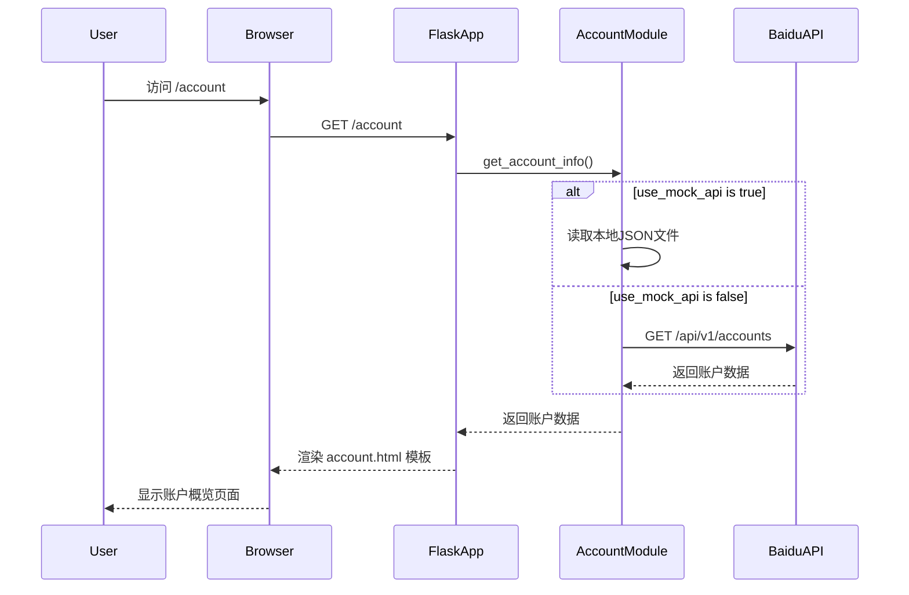
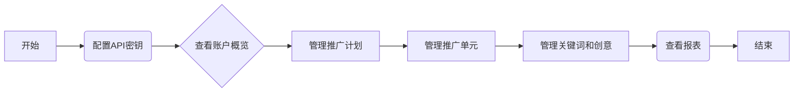

# 百度搜索广告投放管理系统

这是一个基于Python Flask的Web应用，用于管理百度搜索广告的投放。它提供了一个简单的界面来查看和管理账户、计划、单元、关键词和创意等。

## 项目架构

```mermaid
graph TD
    A[用户] --> B{浏览器};
    B --> C[Flask应用 (app.py)];
    C --> D{业务逻辑模块 (src/)};
    D --> E{数据源};
    subgraph 数据源
        direction LR
        E_API[百度推广API]
        E_Local[本地JSON文件]
    end
    E --> D;
```

## 函数调用关系 (以账户模块为例)



## 用户使用流程



## 部署方法

1.  **克隆项目**

    ```bash
    git clone <your-repository-url>
    cd <repository-directory>
    ```

2.  **创建并激活Python虚拟环境**

    对于Windows:
    ```bash
    python -m venv venv
    venv\Scripts\activate
    ```

    对于macOS和Linux:
    ```bash
    python3 -m venv venv
    source venv/bin/activate
    ```

3.  **安装依赖**

    ```bash
    pip install -r requirements.txt
    ```

4.  **配置API**

    -   将 `config/api_config.json` 中的 `YOUR_API_KEY` 和 `YOUR_API_SECRET` 替换为您自己的百度推广API密钥。
    -   根据需要修改 `config/app_config.json` 中的 `use_mock_api` 来切换使用模拟数据或真实API。

5.  **运行应用**

    ```bash
    python app.py
    ```

    应用启动后，在浏览器中打开 `http://127.0.0.1:5000` 即可访问。